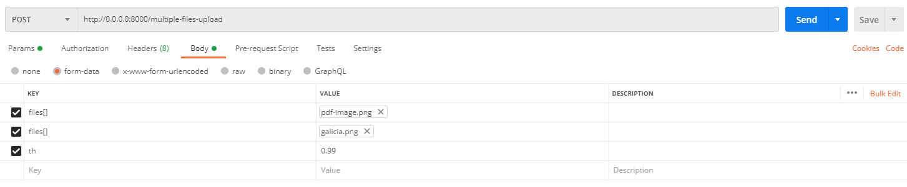
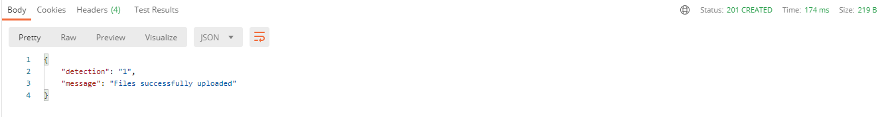

# Microservicio para reconocimiento de logo

Este microservicio es capaz de reconocer si un logo especifico se encuentra en una imagen, utilizando 3 parametros.

- Imagen Original: Imagen en la cual se quiere buscar el logo.
- Logo: El logo que se va a buscar en la imagen original.
- Threshold: Umbral de confianza que usa el algoritmo de reconocimiento, mientras mas alto mas exigente sera en la busqueda (por ende menos resultados).


## Opciones para lanzar el microservicio

### Creando la imagen desde cero

Primero debemos tener el repo en nuestra PC y tambien docker.

- Instalar docker en windows: [Instalar Docker en Windows](https://docs.docker.com/desktop/windows/install/)
- Instalar docker en Mac: [Instalar Docker en Mac](https://docs.docker.com/desktop/mac/install/)

Luego debemos usar la terminal y ubicarnos en el folder inicial donde esta el archivo docker-compose.yml

- Primero debes crear la imagen con el siguiente comando:
```
docker-compose build
 ```

- Luego podemos lanzar el servicio completo con el comando:
```
docker-compose up
 ```

Si todo va bien ya deberias tener el servicio corriendo.

Para probar el microservicio podemos testearlo usando POSTMAN, si no lo tenes descargado te dejamos el link.

[Descargar POSTMAN](https://www.postman.com/downloads/)

La peticion que debemos hacer a la API debera ser un POST y el endpoint es el siguiente:

**http://0.0.0.0:8000/multiple-files-upload**

### Ejemplo de peticion



- Primero debes seleccionar el tipo POST y poner el endpoint
- Debes seleccionar la opcion Body
- Luego llenar las Keys como se ve en la Imagen
- Lo siguiente seria llenar los valores de cada llaven, en las dos primeras son imagenes. La primera es la imagen original y la segunda el logo que deseamos buscar. El tercero es el Threshold/Umbral, recuerda que mientras mas alto mas exigente sera.
- **Las imagenes para la prueba estan ubicadas en el folder images_for_test/**
- Por ultimo debes apretar el boton Send y esperar la respuesta!

La respuesta final deberia verse de esta manera:



Simplemente significa que encontro el logo en la imagen ya que el resultado es 1. Si me devuelve 0 significa que no encontro nada.


## Lanzar el microservicio con la imagen descargada

En este caso vamos a tener que descargar la imagen, la cual se encuentra en el repositorio fscorar07. La imagen se encuentra directamente en la carpeta **I-D\docker_images\logo_matching_service**

Lo siguiente es instalar la imagen en docker, ubicarnos en la terminal en el directorio donde esta la imagen y correr el siguiente comando:
```
docker load < tm_logo_image.tar.gz

 ```

Ya tenemos instalada la imagen en nuestro docker, lo proximo es chequear que realmente este instalada. Para esto debemos utilizar el siguiente comando.

```
docker images

 ```

Si aparece nuestra nueva imagen ahi ya estamos listos para lanzar todo utilizando el docker-compose-with-image

Para lanzar el microservicio en este caso usamos el comando:

```
docker-compose -f docker-compose-with-image.yml up
```
