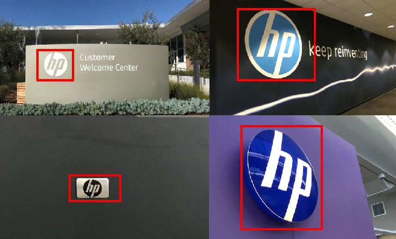

# Microservicio para reconocimiento de logo

## Para que sirve?

Este microservicio nos permite aislar en una aplicacion la tarea de poder reconocer si un logo existe o no en una imagen/pdf. De esta manera podemos ser capaces de automatizar tareas de testing utilizando Computer Vision.

En este caso utilizamos una herramienta llamada Template Matching, tecnica que se encarga de encontrar pequeñas partes de una imagen que coincidan con una imagen de plantilla(template).

·· cambiar una imagen con el logo de vates

## Funcionalidad

El microservicio es capaz de reconocer si un logo especifico se encuentra en una imagen, utilizando 3 parametros.

- Imagen Original: Imagen en la cual se quiere buscar el logo.
- Logo: El logo que se va a buscar en la imagen original.
- Threshold: Umbral de confianza que usa el algoritmo de reconocimiento, mientras mas alto mas exigente sera en la busqueda (por ende menos resultados).

## Tecnologias utilizadas

